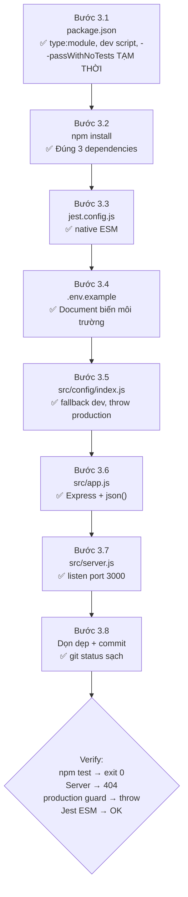

# 📦 Kế hoạch triển khai Module 1 — Khởi tạo dự án

> **Tham chiếu:** [system-design.md → Step 1](file:///c:/Personal%20Expense%20Tracker%20API/expense-tracker/specs/system-design.md#L713-L718)
> **Phiên bản:** 1.1 (đã chốt Q1/Q2/Q3)
> **Ngày:** 2026-10-08

---

## Quyết định đã chốt

| # | Câu hỏi | Quyết định |
|---|---------|------------|
| Q1 | Dev script | Thêm `"dev": "node --watch src/server.js"` (dùng `--watch` built-in của Node ≥ 18, không cần cài thêm thư viện). |
| Q2 | JWT secret fallback | **Environment-aware:** Nếu `NODE_ENV !== 'production'` → dùng giá trị mặc định. Nếu `NODE_ENV === 'production'` mà thiếu biến → `throw Error` ngay khi khởi động. Test phải set `JWT_SECRET` tường minh, không dựa vào mặc định. Thêm `.env.example`. |
| Q3 | `--passWithNoTests` | Thêm tạm thời, **bắt buộc xóa** khi file test đầu tiên xuất hiện (Step 2). Ghi chú vào `package.json`. |

---

## 1. Mục tiêu & Phạm vi

### 1.1 Mục tiêu

Tạo nền tảng Node.js project hoạt động được tối thiểu:
- Khởi tạo `package.json` với ES Modules (`"type": "module"`).
- Cài đặt **đúng 3 dependencies** theo quy chuẩn: `express`, `jest`, `supertest`.
- Tạo cấu hình Jest tương thích native ESM.
- Tạo `app.js` (Express app instance, **không listen**) và `server.js` (entry point).
- Tạo `config/index.js` environment-aware: fallback ở dev/test, throw lỗi ở production nếu thiếu biến.
- Tạo `.env.example` documenting các biến môi trường cần có.
- Server khởi động thành công tại port 3000, trả `404` cho mọi route chưa khai báo.
- `npm test` chạy được (chưa có test file — Jest exit sạch nhờ `--passWithNoTests`).

### 1.2 Thuộc phạm vi Module 1

| Item | Mô tả |
|------|-------|
| `package.json` | Metadata, `"type": "module"`, `"engines"`, scripts (`start`, `dev`, `test`), dependencies |
| `jest.config.js` | Cấu hình Jest cho native ESM |
| `.env.example` | Tài liệu hóa các biến môi trường cần có |
| `src/config/index.js` | Export config environment-aware |
| `src/app.js` | Express app + JSON parser, export instance |
| `src/server.js` | Entry point gọi `app.listen()` |

### 1.3 KHÔNG thuộc phạm vi Module 1

- ❌ Không tạo route, controller, service, repository nào.
- ❌ Không tạo `AppError`, `errorHandler`, `authMiddleware` (→ Step 2).
- ❌ Không tạo thư mục `utils/`, `errors/`, `middleware/` (→ Step 2).
- ❌ Không viết business logic hay validation.
- ❌ Không cài thêm thư viện ngoài 3 thư viện cho phép.

---

## 2. Danh sách file tạo / sửa

| # | File | Hành động | Vai trò |
|---|------|-----------|---------|
| 1 | `package.json` | **Tạo mới** | Metadata, `"type": "module"`, `"engines"`, scripts, dependencies |
| 2 | `jest.config.js` | **Tạo mới** | Cấu hình Jest native ESM |
| 3 | `.env.example` | **Tạo mới** | Template biến môi trường (được commit vào git) |
| 4 | `src/config/index.js` | **Tạo mới** | Config environment-aware với production guard |
| 5 | `src/app.js` | **Tạo mới** | Express app + `express.json()`, export `app` |
| 6 | `src/server.js` | **Tạo mới** | Entry point: import `app`, gọi `app.listen()` |
| 7 | `.gitkeep` files | **Xóa** | Xóa placeholder trong `src/controllers/`, `src/services/`, `src/repositories/`, `tests/` |
| 8 | `system_design_plan.md` (gốc) | **Xóa** | Bản sao thừa, đã có trong `specs/system-design.md` |

> [!NOTE]
> `.gitignore` đã đúng: `.env` bị ignore, `.env.example` được ngoại trừ bằng `!.env.example`. Không cần sửa.

---

## 3. Các bước thực hiện (theo thứ tự)

### Bước 3.1 — Khởi tạo `package.json`

**Thực hiện:**
- Chạy `npm init -y`, sau đó chỉnh sửa:
  - `"type": "module"`
  - `"engines": { "node": ">=20.0.0" }`
  - `"main": "src/server.js"`
  - Scripts:
    ```json
    "scripts": {
      "start": "node src/server.js",
      "dev":   "node --watch src/server.js",
      "test":  "node --experimental-vm-modules node_modules/jest/bin/jest.js --passWithNoTests"
    }
    ```

> [!WARNING]
> Flag `--passWithNoTests` là **TẠM THỜI**. Phải xóa ngay khi file test đầu tiên được tạo ở **Step 2**. Ghi chú vào `package.json` bằng comment trong `README` hoặc commit message để nhắc nhở. Mục đích: sau này nếu ai xóa nhầm test, CI vẫn báo đỏ (exit code 1).

**DoD:**
- [x] `"type"` = `"module"`
- [x] `"engines.node"` = `">=20.0.0"`
- [x] Script `test` chứa `--experimental-vm-modules` và `--passWithNoTests`
- [x] Script `dev` = `"node --watch src/server.js"`

---

### Bước 3.2 — Cài dependencies

**Thực hiện:**
```bash
npm install express
npm install --save-dev jest supertest
```

**DoD:**
- [x] `express` trong `dependencies`
- [x] `jest`, `supertest` trong `devDependencies`
- [x] **Tổng số dependencies chính xác là 3** — không có thư viện nào khác
- [x] `package-lock.json` được sinh

---

### Bước 3.3 — Tạo `jest.config.js`

**Thực hiện:**
File dùng `export default` (ESM) theo [system-design.md dòng 551–558](file:///c:/Personal%20Expense%20Tracker%20API/expense-tracker/specs/system-design.md#L551-L558):
```
export default {
  transform: {},           // Không dùng Babel — native ESM
  testEnvironment: 'node',
  testMatch: ['**/tests/**/*.test.js']
}
```

> [!NOTE]
> `extensionsToTreatAsEsm` không cần thiết vì `.js` files đã là ESM thông qua `"type": "module"` trong `package.json`. Nếu cần, chỉ thêm khi gặp lỗi cụ thể.

**DoD:**
- [x] File dùng `export default` (không phải `module.exports`)
- [x] `npm test` chạy thành công (exit code 0 nhờ `--passWithNoTests`)

---

### Bước 3.4 — Tạo `.env.example`

**Thực hiện:**
Template documenting các biến môi trường cần thiết:

```
# Server Configuration
PORT=3000

# JWT Configuration
# REQUIRED in production. Must be a long, random, secret string.
JWT_SECRET=your-secret-key-here

# Node Environment
# Values: development | test | production
NODE_ENV=development
```

**DoD:**
- [x] File tồn tại và được commit vào git (không bị ignore)
- [x] Liệt kê đủ `PORT`, `JWT_SECRET`, `NODE_ENV`
- [x] Comment rõ `JWT_SECRET` là bắt buộc ở production

---

### Bước 3.5 — Tạo `src/config/index.js`

**Logic environment-aware (đã được chốt tại Q2):**

```
Pseudo-code:
  const isProduction = process.env.NODE_ENV === 'production'

  function requireEnv(key, defaultValue) {
    const value = process.env[key]
    if (!value && isProduction) {
      throw new Error(`[Config] Missing required env var: ${key}`)
    }
    return value ?? defaultValue
  }

  export const config = {
    port: parseInt(process.env.PORT ?? '3000', 10),
    jwtSecret: requireEnv('JWT_SECRET', 'expense-tracker-dev-secret'),
    nodeEnv: process.env.NODE_ENV ?? 'development'
  }
```

> [!IMPORTANT]
> **Quy tắc cho test (từ Q2):** Integration test và unit test của `authService` phải tường minh set `process.env.JWT_SECRET = 'test-secret'` trong `beforeAll` — không được phụ thuộc vào giá trị mặc định. Điều này tránh test pass locally nhưng fail ở production environment.

**DoD:**
- [x] Import thành công từ module khác
- [x] `config.port` = `3000` khi không set `PORT`
- [x] `config.jwtSecret` = `'expense-tracker-dev-secret'` khi `NODE_ENV !== 'production'`
- [x] Nếu đặt `NODE_ENV=production` và không set `JWT_SECRET` → throw `Error` với message rõ ràng
- [x] Không có giá trị `undefined` trong object config

---

### Bước 3.6 — Tạo `src/app.js`

**Thực hiện:**

```
Pseudo-code:
  import express from 'express'
  
  const app = express()
  
  app.use(express.json())
  
  // Routes và middleware sẽ được mount dần ở các Step 2–5+
  // Composition Root sẽ được hoàn thiện ở Step 5
  
  export default app
```

> [!IMPORTANT]
> Ở Module 1, `app.js` **chỉ là Express app với JSON parser**. Các Step sau sẽ dần thêm:
> - Step 2: mount `errorHandler` middleware
> - Step 5: mount `authRoutes` + `authMiddleware` + khởi tạo DI (repo, service)
> - Step 8, 11, 14: mount thêm routes

**DoD:**
- [x] `app` được export thành công
- [x] Gửi request bất kỳ → nhận `404` (Express default)
- [x] Request với body JSON → không crash

---

### Bước 3.7 — Tạo `src/server.js`

**Thực hiện:**

```
Pseudo-code:
  import app from './app.js'
  import { config } from './config/index.js'
  
  app.listen(config.port, () => {
    console.log(`Server is running on port ${config.port}`)
  })
```

**DoD:**
- [x] `node src/server.js` khởi động server
- [x] Console log có chứa port
- [x] `http://localhost:3000/api/v1/anything` → HTTP 404
- [x] Ctrl+C tắt sạch

---

### Bước 3.8 — Dọn dẹp & Commit

**Thực hiện:**
- Xóa `.gitkeep` trong `src/controllers/`, `src/services/`, `src/repositories/`, `tests/`
- Xóa `system_design_plan.md` ở gốc (bản sao thừa)
- Verify `npm test` pass (exit 0)
- Verify `node src/server.js` khởi động
- Commit: `feat(step-1): initialize Node.js project with ESM, Express, Jest config`

**DoD:**
- [x] Không còn `.gitkeep` nào
- [x] Không còn `system_design_plan.md` trùng lặp
- [x] `git status` sạch sau commit
- [x] `npm test` exit code 0
- [x] Server khởi động và trả 404

---

## 4. Kiểm thử

### 4.1 Không có unit test ở Module 1

Unit test đầu tiên xuất hiện ở **Step 2** (`validators.test.js`, `dateUtils.test.js`). Module 1 không có hàm nghiệp vụ cần test.

**Nhắc nhở quan trọng:** Khi tạo file test đầu tiên ở Step 2:
1. Xóa flag `--passWithNoTests` khỏi script `test` trong `package.json`.
2. Commit kèm message: `chore: remove --passWithNoTests flag (first test added)`.

### 4.2 Xác minh Jest + ESM hoạt động (bước phòng ngừa rủi ro)

Tạo file **tạm** `tests/unit/setup-verify.test.js` với nội dung:
```
test('Jest ESM works', () => {
  expect(1 + 1).toBe(2)
})
```
Chạy `npm test`. Kết quả mong đợi: **1 passed**. Sau đó **xóa ngay file tạm** — file test thực sự sẽ được tạo ở Step 2.

> [!WARNING]
> Đây là **rủi ro kỹ thuật số 1** của toàn dự án (ghi nhận tại [system-design.md dòng 833](file:///c:/Personal%20Expense%20Tracker%20API/expense-tracker/specs/system-design.md#L833)). Nếu gặp lỗi ESM, kiểm tra:
> - `jest.config.js` dùng `export default` (không phải `module.exports`)
> - `package.json` có `"type": "module"`
> - Node.js version ≥ 20

### 4.3 Manual verification checklist

| # | Lệnh / Hành động | Kết quả mong đợi |
|---|------------------|-------------------|
| 1 | `node -v` | `v20.x.x` trở lên |
| 2 | `npm test` | Exit code 0, "no tests found" hoặc "passed" |
| 3 | `node src/server.js` | `Server is running on port 3000` |
| 4 | GET `http://localhost:3000/api/v1/test` | HTTP 404 |
| 5 | POST với body JSON | Không crash (JSON parser hoạt động) |
| 6 | `NODE_ENV=production node src/server.js` (không set JWT_SECRET) | Server không khởi động, throw Error rõ ràng |
| 7 | Ctrl+C | Thoát sạch |

---

## 5. Kiểm tra hoạt động độc lập

Module 1 **hoàn toàn độc lập**:

| Tiêu chí | Giải thích |
|----------|------------|
| Không import module chưa tồn tại | `app.js` chỉ import `express`. `server.js` chỉ import `app.js` và `config/index.js`. |
| Không có route nào | 404 cho mọi request — đúng hành vi mong đợi. |
| Config tự đủ | `config/index.js` không import bất kỳ module nội bộ nào. |
| Jest độc lập | `jest.config.js` chỉ khai báo cấu hình. |

**Bài kiểm tra tính độc lập:** Xóa `src/controllers/`, `src/services/`, `src/repositories/`, `tests/` (nếu rỗng) → server vẫn phải khởi động bình thường.

---

## 6. Mâu thuẫn đã giải quyết / còn lại

| # | Mô tả | Trạng thái |
|---|-------|------------|
| M1 | README ghi `npm run dev` nhưng system-design Step 1 không nhắc | ✅ Giải quyết: thêm script `"dev"` vào `package.json` (Q1). Cần cập nhật system-design.md để đồng bộ. |
| M2 | `app.js` vừa là Composition Root vừa export cho supertest — có thể duplicate seed | ✅ Không ảnh hưởng Module 1 (chưa có DI). ESM module cache tự động đảm bảo chỉ execute 1 lần. Sẽ xử lý khi cần export repositories cho integration test ở Step 5+. |

---

## Tóm tắt lộ trình Module 1



> [!IMPORTANT]
> **Nhắc nhở Step 2:** Khi tạo file test đầu tiên, xóa `--passWithNoTests` khỏi `package.json` ngay lập tức và commit riêng để lịch sử rõ ràng.
